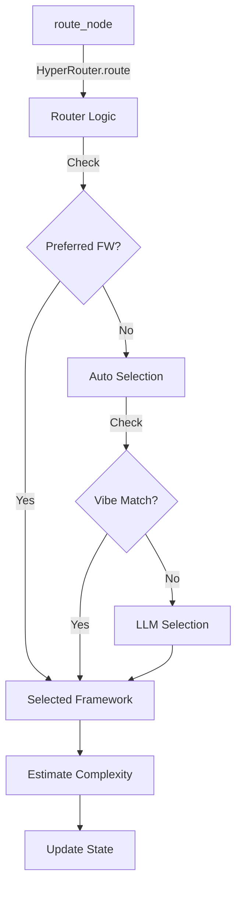
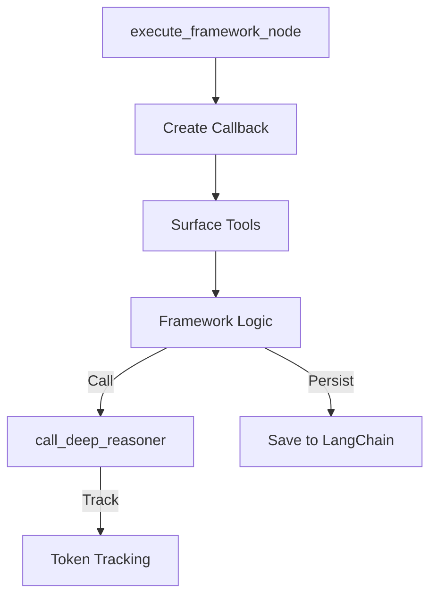
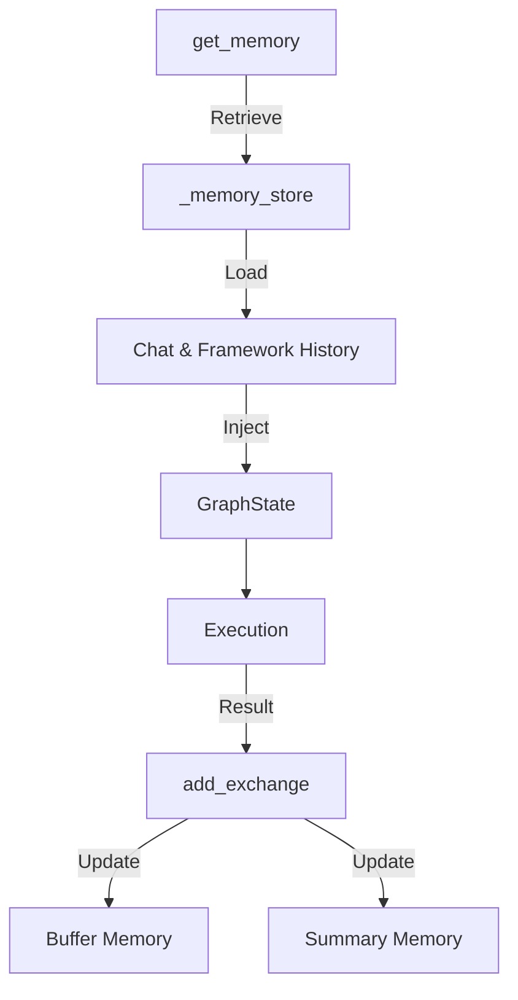
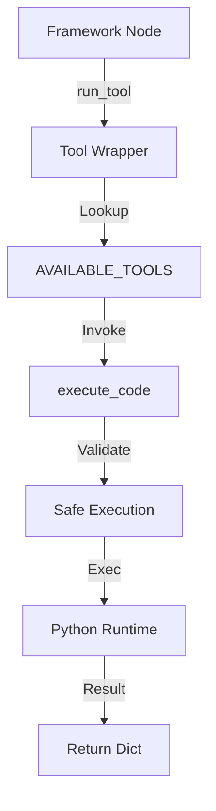
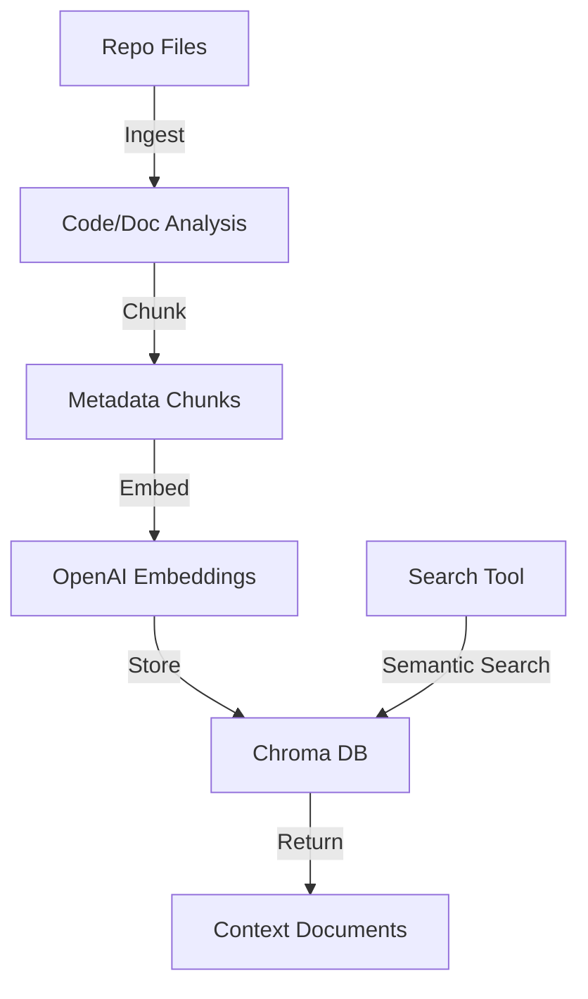
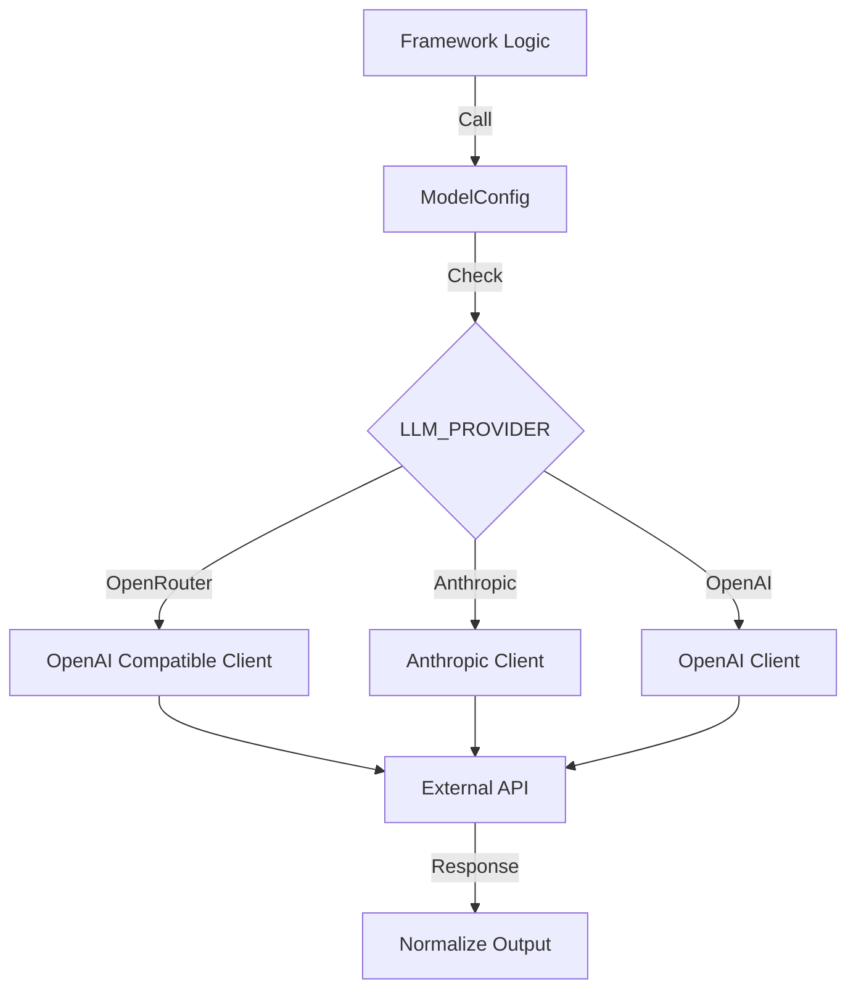
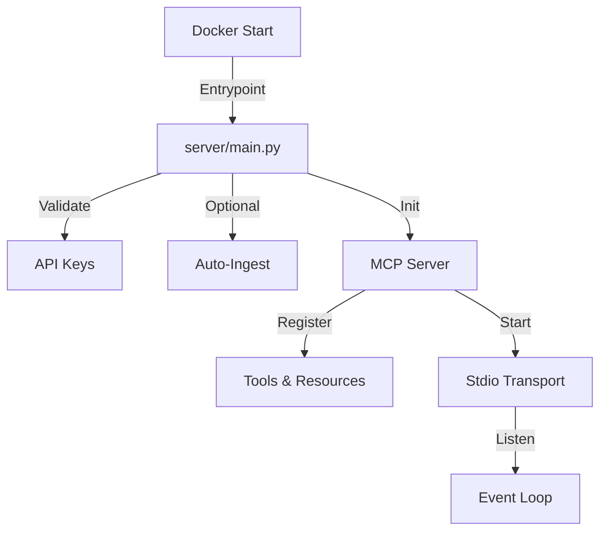

# Omni-Cortex MCP Server: Architecture & Execution Flow

This document provides a comprehensive technical reference for the Omni-Cortex MCP Server, detailing the complete execution flow, component interactions, and data paths. It is designed to serve as context for LLMs and developers working on the system.

## System Overview

Omni-Cortex is a headless AI microservice that exposes 20+ reasoning frameworks as Model Context Protocol (MCP) tools. It orchestrates complex reasoning tasks using LangGraph, maintains conversation context via LangChain, and integrates with a Chroma vector database for RAG.

### Key Components
1.  **MCP Server (`server/main.py`)**: Entry point handling MCP tool calls and connection management.
2.  **Orchestrator (`app/graph.py`)**: LangGraph workflow managing the reasoning lifecycle (Routing → Execution → Response).
3.  **Router (`app/core/router.py`)**: AI-powered "HyperRouter" that selects the optimal framework for a given task.
4.  **Frameworks (`app/nodes/`)**: 20 specialized reasoning implementations (e.g., Active Inference, Tree of Thoughts).
5.  **Memory System (`app/langchain_integration.py`)**: Thread-based persistence using LangChain memory structures.
6.  **Vector Store (`app/ingest_repo.py`)**: RAG system using Chroma for code and documentation retrieval.

---

## Trace 1: MCP Request → Framework Execution → Response

**Description**: The core request lifecycle from the IDE to the final response.

```mermaid
graph TD
    IDE[IDE / Client] -->|call_tool('reason')| Main[server/main.py]
    Main -->|execute_reasoning| Graph[app/graph.py]
    Graph -->|route_node| Router[HyperRouter]
    Router -->|Select Framework| Framework[Framework Node]
    Framework -->|Execute| Results[Result State]
    Results -->|Format| Response[MCP TextContent]
    Response --> IDE
```

**Flow Steps:**
1.  **MCP Tool Handler** (`1a`): `server/main.py` receives a `call_tool("reason", arguments)` request.
    *   **Internal**: Validates arguments against schema (query required, code_snippet optional).
    *   **Error**: Returns text error if validation fails.
2.  **State Initialization** (`1b`): `create_initial_state()` builds the `GraphState` with the user query and context.
3.  **Memory Retrieval** (`1c`): `get_memory(thread_id)` loads existing conversation history for the thread.
4.  **LangGraph Invocation** (`1d`): `graph.ainvoke(state)` starts the workflow.
    *   **Checkpointing**: Saves initial state to SQLite (`checkpoints.sqlite`).
5.  **Routing** (`1e`): `route_node` enhances state with memory and calls the router.
6.  **Framework Execution** (`1f`): `execute_framework_node` runs the selected framework (e.g., `fw_active_inference`).
7.  **Response Formatting** (`1g`): `format_reasoning_response` converts the final state into a user-friendly string.

**Component Internals**:
- **Graph Compilation**: The graph is compiled once at startup with `SqliteSaver`.
- **Async Execution**: Entire flow is async/await to handle I/O bound LLM calls efficiently.


---

## Trace 2: AI-Powered Framework Selection (HyperRouter)

**Description**: How the system decides which reasoning framework to use.



**Logic Flow:**
1.  **Entry**: `route_node` invokes `HyperRouter.route(state)`.
2.  **Override Check**: If `preferred_framework` argument is present, bypass selection.
3.  **Vibe Check (Fast Path)** (`2c`): `_check_vibe_dictionary` matches query patterns (e.g., "debug" -> Active Inference).
4.  **LLM Selection (Smart Path)** (`2d`):
    *   Constructs a prompt with the query and available frameworks.
    *   Calls the "fast" model (e.g., GPT-4o-mini/Flash) to select the best fit.
5.  **Complexity Estimation** (`2e`): Scores task complexity (0-1) based on query length and code context size.
6.  **State Update** (`2f`): Updates `state["selected_framework"]` which directs the LangGraph edge.

**Code Reference**: `app/core/router.py`

**Critical Decision Logic**:
- **Fast Path**: `_check_vibe_dictionary` allows instant routing for well-known queries, bypassing the router LLM latency (~50ms).
- **Fallback**: If LLM selection fails, defaults to `self_discover` (safe exploration).


---

## Trace 3: Framework Node Execution

**Description**: The execution context within a framework node.



**Key Mechanisms:**
1.  **Callback Creation** (`3a`): `OmniCortexCallback` is instantiated to track token usage and LLM events.
2.  **Tool Surfacing** (`3b`): `list_tools_for_framework` populates `recommended_tools` in the context.
3.  **Framework Logic** (`3c`): The specific node (e.g., `reason_flux_node`) executes.
    *   It calls `call_deep_reasoner` for LLM generation.
    *   It calls `run_tool` for external actions (search, code execution).
4.  **Token Tracking** (`3f`): Usage stats are accumulated in `state["tokens_used"]`.
5.  **Persistence** (`3g`): `save_to_langchain_memory` commits the interaction to history.

**Component Internals & Error Handling:**
- **Quiet-STaR**: If enabled, framework logic injects "quiet thoughts" into the context before the final answer to improve reasoning depth.
- **Fail-safe**: Most framework nodes wrap critical steps in `try/except` blocks to return a partial state rather than crashing the entire graph.
- **Context Limits**: Large context is managed via token counting in `call_deep_reasoner`. If the prompt exceeds limits, older memory turns are compressed.

---

## Trace 4: LangChain Memory System

**Description**: Management of conversation context across stateless MCP calls.



**Structure:**
- **Scope**: Thread-based (`thread_id`).
- **Storage**: In-memory LRU cache (`_memory_store`) backed by LangChain's `ConversationBufferMemory` and `ConversationSummaryMemory`.

**Flow:**
1.  **Retrieval** (`4a`): `get_memory(thread_id)` fetches the `OmniCortexMemory` object.
2.  **Enhancement** (`4d`): Before routing, `enhance_state_with_langchain` injects `chat_history` and `framework_history` into `state["working_memory"]`.
3.  **Execution Access**: Frameworks read this history to understand prior context.
4.  **Persistence** (`4e`): After execution, `memory.add_exchange(query, answer, framework)` updates the buffer.
5.  **Checkpointing**: LangGraph automatically saves the full state snapshot to SQLite.

**Component Internals & Error Handling:**
- **LRU Eviction**: To prevent memory leaks, `_memory_store` keeps only the last 100 active threads (`MAX_MEMORY_THREADS`). Older threads are dropped from RAM (though LangGraph SQLite checkpoints persist on disk).
- **Missing Thread ID**: If no `thread_id` is provided, a new UUID is generated for the session, effectively treating it as a stateless "one-off" request.
- **Summary Compression**: `ConversationSummaryMemory` automatically summarizes history when it exceeds token thresholds, keeping the prompt context manageable.

---

## Trace 5: LangChain Tool Execution (Code Sandbox)

**Description**: Safe execution of tools, specifically the Python code sandbox.



**Flow:**
1.  **Invocation** (`5a`): Framework calls `run_tool(name, input, state)`.
2.  **Lookup** (`5b`): System finds the matching tool in `AVAILABLE_TOOLS` (e.g., `execute_code`).
3.  **Execution** (`5c`): `tool.ainvoke(input)` is called.
4.  **Sandbox** (`5d`): For `execute_code`, control passes to `_safe_execute`.
    *   **Filtering**: Checks for dangerous imports (os, sys, subprocess).
    *   **Isolation**: Uses `exec()` with a restricted `globals` dictionary.
5.  **Result**: Returns a standardized dictionary: `{"success": bool, "output": str, "error": str}`.

**Component Internals & Error Handling:**
- **AST Parsing**: `_safe_execute` parses code into an AST *before* execution. It walks the tree to block forbidden nodes (e.g., `Import`, `ImportFrom` for non-whitelisted modules).
- **Timeouts**: Execution is strictly limited to 5.0 seconds (`timeout` parameter) to prevent infinite loops.
- **Output Capture**: `sys.stdout` is redirected to a string buffer to capture print statements.
- **Exception Catching**: Any runtime error is caught and returned as the `error` field in the result dict, preventing tool crashes from halting the reasoning graph.

---

## Trace 6: Vector Store RAG (Documentation Search)

**Description**: The enhanced Retrieval-Augmented Generation system.



**Components:**
*   **Ingestion**: `app/enhanced_ingestion.py` (New) / `app/ingest_repo.py` (Legacy).
*   **Store**: Chroma DB (`app/data/chroma`).
*   **Search**: Specialized MCP tools in `app/enhanced_search_tools.py`.

**Flow:**
1.  **Ingestion** (`6a`): Scans repository files (.py, .md, .txt).
2.  **Analysis**:
    *   **Code**: AST parsing extracts functions, classes, and dependencies.
    *   **Docs**: Markdown parsing splits by sections.
3.  **Embedding** (`6c`): Uses `text-embedding-3-large` via `OpenAIEmbeddings`.
4.  **Routing**: `CollectionManager` routes chunks to specialized collections (frameworks, docs, tests, etc.).
5.  **Search** (`6d`): Framework calls `search_function_implementation` or `search_by_category`.
6.  **Retrieval** (`6e`): Chroma performs semantic search with metadata filtering and returns top-k contexts.

**Component Internals & Error Handling:**
- **Collection Routing**: `CollectionManager` uses metadata rules (e.g., `category="framework"`) to target specific Chroma collections, improving search precision.
- **Fail-safe Search**: `search_vectorstore` wraps Chroma calls in `try/except`. If the database is locked or unreachable, it returns an empty list instead of raising, allowing the framework to proceed with "general knowledge".
- **Zero-Shot Ingestion**: If the vector store is empty, `search_documentation` returns a helpful message prompting the user to run ingestion.

---

## Trace 7: Multi-Provider LLM Client Management

**Description**: Abstraction layer for handling different LLM providers (OpenRouter, Anthropic, OpenAI).



**Flow:**
1.  **Call** (`7a`): Framework invokes `call_deep_reasoner`.
2.  **Config**: `ModelConfig` checks `LLM_PROVIDER` env var.
3.  **Routing** (`7c`):
    *   **OpenRouter**: Uses `openai` python client pointed at `openrouter.ai/api/v1`.
    *   **Anthropic**: Uses native `anthropic` client for direct access.
    *   **OpenAI**: Uses standard `openai` client.
4.  **Normalization**: Response text and token usage are extracted and normalized into a standard tuple return format.

**Component Internals & Error Handling:**
- **Client Caching**: `ModelConfig` is a singleton that caches API clients to avoid re-initialization overhead.
- **Model Name Mapping**: It handles provider-specific model naming conventions (e.g., stripping `anthropic/` prefix for the native client).
- **Graceful Failures**: Network errors or API rate limits raise exceptions that bubble up to the framework node. Frameworks can catch these to implement retries or fallbacks (though basic retry logic is often handled by the `openai` client default).

---

## Trace 8: Deployment & Startup

**Description**: System initialization sequence.



**Sequence:**
1.  **Entrypoint** (`8a`): Docker runs `python -m server.main`.
2.  **Validation** (`8c`): Checks for required API keys based on provider configuration.
3.  **Auto-Ingest** (`8d`): If `ENABLE_AUTO_INGEST=true`, triggers `ingest_repo_main()` to refresh RAG index.
4.  **Server Init** (`8e`): Initializes the MCP Server instance (`Omni-Cortex`).
5.  **Resource Registration**: registers tools (`list_tools`) and resources (`list_resources`).
6.  **Transport** (`8f`): Starts the stdio transport layer for communication with the IDE.
7.  **Loop** (`8g`): Enters the main event loop, awaiting JSON-RPC messages.

**Component Internals & Error Handling:**
- **Stdio Transport**: Uses standard input/output streams for communication. Logs are written to `stderr` to avoid corrupting the JSON-RPC message stream on `stdout`.
- **Signal Handling**: The server handles `SIGINT` (Ctrl+C) and `SIGTERM` for graceful shutdown, ensuring database connections are closed properly.
- **Startup Validation**: If `LLM_PROVIDER` is set to `anthropic` but `ANTHROPIC_API_KEY` is missing, the server raises a `RuntimeError` immediately at startup, preventing a "zombie" state where the server runs but cannot execute requests.
- **Ingestion Lock**: Auto-ingestion runs in the main thread before the server loop starts to ensure the RAG index is ready before any search tools can be called.

---

## 9. Deep Dive: Data Structures & State Management

To effectively reason about the system, LLMs must understand the central data structure: `GraphState`.

### Core State Schema (`GraphState`)

The state is a `TypedDict` that flows through every node in the graph. It is the "short-term memory" of the reasoning process.

```python
class GraphState(TypedDict):
    # --- Input Context ---
    query: str                  # The user's original natural language request
    code_snippet: Optional[str] # Selected code from the IDE (if any)
    file_list: Optional[List[str]] # List of relevant files in the workspace
    ide_context: Optional[str]  # Additional context (cursor position, linter errors)

    # --- Routing Metadata ---
    task_type: str              # Inferred type: 'debug', 'refactor', 'architect', etc.
    complexity_estimate: float  # 0.0 to 1.0 score driving resource allocation
    selected_framework: str     # The framework chosen by HyperRouter (e.g., 'active_inference')
    
    # --- Execution Artifacts ---
    reasoning_steps: List[Dict] # Structured trace of thought steps (Thought, Action, Observation)
    final_answer: str           # The synthesized textual response
    final_code: str             # Any generated code blocks
    quiet_thoughts: List[str]   # Hidden "scratchpad" thoughts (Quiet-STaR pattern)
    
    # --- Working Memory (Transient) ---
    working_memory: Dict[str, Any]
    # {
    #   "thread_id": str,                 # Conversation continuity ID
    #   "chat_history": str,              # Formatted history from LangChain
    #   "framework_history": List[str],   # Which frameworks ran previously
    #   "available_tools": List[str],     # Tools exposed to this node
    #   "langchain_callback": Any,        # Active callback handler
    #   "recommended_tools": List[str]    # Tools suggested for the current framework
    # }

    # --- Metrics ---
    tokens_used: int            # Total token consumption counter
    confidence_score: float     # 0.0 to 1.0 confidence in the final result
```

### Memory Persistence Model

1.  **Short-Term**: `GraphState` exists only during the graph execution (`graph.ainvoke`).
2.  **Medium-Term**: `working_memory["chat_history"]` pulls from LangChain `ConversationBufferMemory`. This persists across turns in the same `thread_id`.
3.  **Long-Term**: `VectorStore` (Chroma) persists knowledge globally across all threads.

---

## 10. LLM Interaction Guide (For Agents)

This section guides other LLMs (like Cursor or Claude) on how to optimally interact with Omni-Cortex.

### Best Practices for Prompting Omni-Cortex

1.  **Vibe over Rigidity**: You don't need to specify the framework. Just describe the *nature* of the problem.
    *   *Bad*: "Use the Tree of Thoughts framework to optimize this."
    *   *Good*: "This code feels sluggish and I'm worried about the O(n^2) complexity. Explore optimization paths."
    
2.  **Provide Context**: Always populate the `code_snippet` and `file_list` arguments if possible.
    *   The `HyperRouter` uses file types and code patterns to pick the right expert.
    *   e.g., Seeing `test_*.py` files triggers the `chain_of_verification` or `critic` frameworks.

3.  **Iterative Debugging**: Use the `thread_id`.
    *   If the first response isn't perfect, send a follow-up with the *same* `thread_id`.
    *   Omni-Cortex will see its previous attempt and switch strategies (e.g., from `active_inference` to `tree_of_thoughts`).

### Interpreting the Response

The `reason` tool returns a structured string. Agents should parse it as:

1.  **Reasoning Trace**: The "Show your work" section. Useful for explaining *why* a decision was made.
2.  **Final Answer**: The actual solution or explanation.
3.  **Code Blocks**: Ready-to-commit code changes.

### Error Handling & Edge Cases

*   **No Framework Selected**: Falls back to `self_discover` (generic reasoning).
*   **Tool Failures**: If a search fails, the framework usually hallucinates a fallback or states "Using general knowledge".
*   **Context Limit**: If `chat_history` gets too long, `ConversationSummaryMemory` kicks in to compress older turns.

---

## 11. Extension Guide: Adding a New Framework

For LLMs tasked with extending Omni-Cortex, follow this pattern to add a 21st framework.

### Step 1: Create the Node
Create `app/nodes/category/my_new_framework.py`.

```python
from ..common import quiet_star, add_reasoning_step
from ...state import GraphState

@quiet_star  # Enable Quiet-STaR thinking
async def my_new_framework_node(state: GraphState) -> GraphState:
    # 1. Parse Input
    query = state["query"]
    
    # 2. Reason (using helpers)
    # ... call_deep_reasoner() ...
    
    # 3. Update State (Trace)
    add_reasoning_step(state, "my_framework", "Thought process", "Action taken", "Observation")
    
    # 4. Set Final Answer
    state["final_answer"] = "Result"
    return state
```

### Step 2: Register the Node
Update `app/graph.py`:

```python
# Import
from .nodes.category.my_new_framework import my_new_framework_node

# Add to mapping
FRAMEWORK_NODES = {
    # ...
    "my_new_framework": my_new_framework_node
}
```

### Step 3: Update Router
Update `app/core/router.py`:

```python
# Add to prompts or VIBE_DICTIONARY
"new framework vibe": "my_new_framework"
```

The system will automatically wire up the new node into the graph, expose it to the router, and handle memory/callbacks without further configuration.


